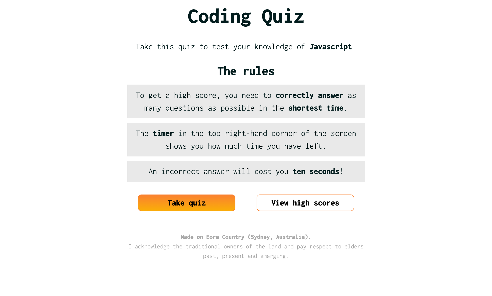

# multiple-choice-coding-quiz

## Description

My goal for this project was to build a timed multiple choice quiz. This allows the user to test their knowledge of Javascript, which might be helpful if they are a developer preparing for a technical interview.

To achieve this, I used HTML, CSS and Javascript.

During this project, I consolidated my understanding of HTML, CSS and Javascript. In particular, I re-inforced what I have learnt about:
- The DOM
- Web APIs
- And, local storage.

## Access

To access the live application via Github Pages, click [here](https://hayleyarodgers.github.io/multiple-choice-coding-quiz/). 

To access the repository where the code I refactored is saved, click [here](https://github.com/hayleyarodgers/multiple-choice-coding-quiz).

## Credits

- I used [this tutorial](https://www.sitepoint.com/simple-javascript-quiz/) to help plan my approach.